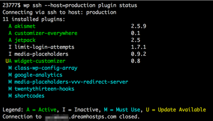

# WP-CLI SSH
*Seamlessly run WP-CLI commands on a remote server via SSH*



WP-CLI is an extremely useful tool for managing WordPress installs, but it requires 
you to invoke it on the same server where WordPress is installed. This means you have
to SSH into the server, navigate to the install, and then run the command. It would
be much more convenient if you could remain on your local shell and invoke WP-CLI 
remotely; this is especially the case when using Vagrant. 

The WP-CLI SSH script is also TTY-aware, so if you try piping the results of a WP-CLI SSH 
command to another program, it will return the machine-formatted output (e.g. no colors or table cells).

## Configuration

Assuming you have a clone of your WordPress install on your machine, add an `ssh` section
to your `wp-cli.yml` config file. In this section you define the remote servers which 
host the other environments for your site, e.g. `vagrant`, `staging`, and `production`. 
Then you just invoke WP-CLI normally, but supply an additional `--host` argument with
host you want to connect to:

```bash
wp ssh plugin status --host=production
```

You can also provide Bash aliases to supply this argument by default:

```bash
alias wp="wp ssh --host=vagrant"
alias wpprod="wp ssh --host=production"
```

Add an `ssh` section to your `wp-cli.yml`/`wp-cli.local.yml`, as seen in the [sample config](wp-cli.sample.yml).
You indicate the `ssh` command templates for each host you want to connect to. The template variable `%cmd%` is 
replaced with the full command to run on the server; the `%pseudotty%` template variable is replaced 
with `-t`/`-T` depending on whether you're on a TTY or piping the command output.

For a step-by-step guide, please refer to the [wiki](https://github.com/x-team/wp-cli-ssh/wiki/Configuring-the-plugin).

## Installation

Note that you do not necessarily need WP-CLI installed on your server to use this. If the `wp` command is not
recognized on the server, the script will download the `wp-cli.phar` file and use that at runtime.

Installing WP-CLI-SSH on your machine can be done either by installation as a Composer package,
or by adding a `require` config to a `wp-cli.local.yml`.

For global composer installation:
```bash
composer global require x-team/wp-cli-ssh dev-master
```

## Alternatives

 * [vassh](https://github.com/x-team/vassh)
 * [`wp` Bash function](https://github.com/humanmade/Salty-WordPress/issues/16)
 * [WP Remote CLI](https://github.com/humanmade/wp-remote-cli/)

